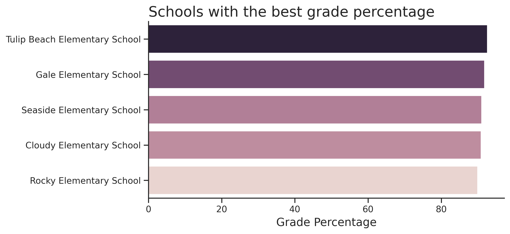
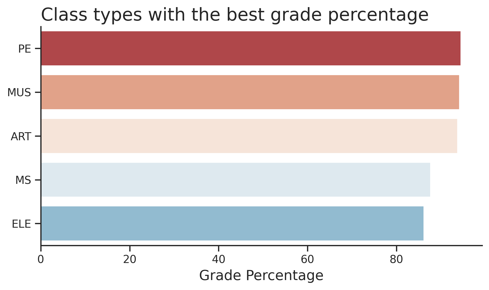

# Student Performance

## 1. Introduction

The Student Performance is a data science authorial project developed using Python libraries to explore and analyze the dataset called <a href="https://www.kaggle.com/datasets/marmarplz/student-academic-grades-and-programs">Student Academic Marks and Programs</a>, which was obtained from <a href="https://www.kaggle.com/">Kaggle</a>. Through this project it’ll be analyzed some characteristics of the academic performance of the students recorded in this dataset.

### 1.1 Key features

The dataset presents a data structure based on some key features:

<ul>
  <li>schoolyear: The academic school year.</li>
  <li>gradeLevel: The grade level of the student.</li>
  <li>classPeriod: The specific class period within the school day.</li>
  <li>classType: The general subject or category of the class.</li>
  <li>SCHOOLNAME: The name of the school the student was enrolled in.</li>
  <li>Program: Indicates whether the student is enrolled in any specialized programs.</li>
  <li>Mark: The student's academic mark for the specific class period.</li>
</ul>

### 1.2 Project focus

The dataset offers a variety of possibilities to explore and analyze its data. So, next there are some questions which will be answered through the project development. These questions aim to guide the project author.

<ul>
  <li>What school has the best grade percentage performance? And about class type?</li>
  <li>How many students from each school are registered in the English Learner Language program?</li>
  <li>What’s the average number of students registered in each program?</li>
  <li>What’s the relation of each grade level and their quantity?</li>
  <li>What’s the  average number of grade percentages about each school year?</li>
</ul>

## 2. Data analysis

### 2.1 Best grade percentage performances

About the best grade percentage performances obtained by students, it was separated by schools and class types. Although, before finding the school and class type students who had these results, it was necessary dealing with grade percentage outliers.

Then, these students and their results were found. It’s possible to analyze, through the following chart, the best grade percentage performances about schools using the average of each of them.

  

 

Analysing the chart, it’s possible to note similar results among the first five schools. This indicates a good balance among them and a fair competition among their students. Next, there’s a chart about the best grade percentage performances about class types using, again, the average of each of them.

  

 

About the class type student’s performances, there’s a small difference in comparison to the school student’s performances. The class type variable values aren’t as similar as in the school ones. However, the difference isn’t considerably big, so, this indicates a good student’s performance in at least five subjects, which means a good balance in their education.

