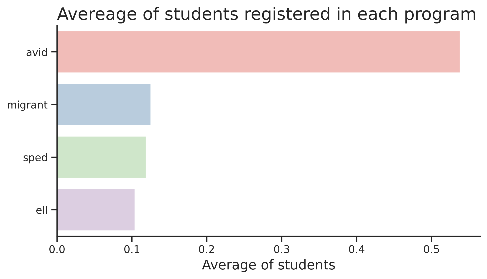

# Student Performance

## 1. Introduction

The Student Performance is a data science authorial project developed using Python libraries to explore and analyze the dataset called <a href="https://www.kaggle.com/datasets/marmarplz/student-academic-grades-and-programs">Student Academic Marks and Programs</a>, which was obtained from <a href="https://www.kaggle.com/">Kaggle</a>. Through this project it’ll be analyzed some characteristics of the academic performance of the students recorded in this dataset.

### 1.1 Key features

The dataset presents a data structure based on some key features:

<ul>
  <li>schoolyear: The academic school year.</li>
  <li>gradeLevel: The grade level of the student.</li>
  <li>classPeriod: The specific class period within the school day.</li>
  <li>classType: The general subject or category of the class.</li>
  <li>SCHOOLNAME: The name of the school the student was enrolled in.</li>
  <li>Program: Indicates whether the student is enrolled in any specialized programs.</li>
  <li>Mark: The student's academic mark for the specific class period.</li>
</ul>

### 1.2 Project focus

The dataset offers a variety of possibilities to explore and analyze its data. So, next there are some questions which will be answered through the project development. These questions aim to guide the project author.

<ul>
  <li>What school has the best grade percentage performance? And about class type?</li>
  <li>How many students from each school are registered in the English Learner Language program?</li>
  <li>What’s the average number of students registered in each program?</li>
  <li>What’s the relation of each grade level and their quantity?</li>
  <li>What’s the  average number of grade percentages about each school year?</li>
</ul>

## 2. Data analysis

### 2.1 Best grade percentage performances

About the best grade percentage performances obtained by students, it was separated by schools and class types. Although, before finding the school and class type students who had these results, it was necessary dealing with grade percentage outliers.

Then, these students and their results were found. It’s possible to analyze, through the following chart, the best grade percentage performances about schools using the average of each of them.

  

 

Analysing the chart, it’s possible to note similar results among the first five schools. This indicates a good balance among them and a fair competition among their students. Next, there’s a chart about the best grade percentage performances about class types using, again, the average of each of them.

  

 

About the class type student’s performances, there’s a small difference in comparison to the school student’s performances. The class type variable values aren’t as similar as in the school ones. However, the difference isn’t considerably big, so, this indicates a good student’s performance in at least five subjects, which means a good balance in their education.

### 2.2 English learner language program

The English learner language programs (ELL) are designed to support students who are learning English as a second language. These programs vary across states and school districts but generally aim to help ELL students develop English language proficiency while also accessing grade-level content.

Analysing the dataset it was possible to verify the schools with the biggest number of students registered in this program. And this can indicate a higher number of foreign students studying there.

  

 

Looking at the previous chart it’s possible to see the difference among these schools. The Gale Elementary School has about one thousand more students registered in the ELL program than the Leafy Elementary School. Furthermore, in relation to these five schools, there are more students learning English as a second language in elementary schools than in high schools.

### 2.3 Average of students registered in each program

The dataset used in this project development brings the number of students registered in four educational programs, which are AVID, SPED, Migrant and ELL. Next there are descriptions about the purpose of each program, unless the ELL which was mentioned before.

AVID, or Advancement Via Individual Determination, is a college readiness program designed to help middle and high school students succeed in rigorous academic courses and prepare for college. It focuses on students who are academically in the middle, earning B, C, and even D grades, and provides them with the support and resources they need to reach their full potential.

SPED stands for Special Education. It's a program designed to provide additional support and services to students with disabilities in US schools. These services are tailored to meet the unique needs of each student and help them reach their full potential.

The Migrant Education Program (MEP) is a federally funded program designed to provide educational support and services to migratory children. These are children who move across school district lines with their families to engage in agricultural or fishing work. So, thinking about it, it was found the average of students registered in each program.

  

 

Through the chart it’s possible to realize that the number of students registered in these programs is very low in comparison to the total number of students recorded in this dataset. And there is a considerable difference among the programs.

The AVID program has a bigger number of students registered in it than the others. Which indicates that there is a bigger group of students interested in having a degree in the future than migrant students and students who have disabilities. Additionally, the number of students who are learning English as a second language is quite lower than the number of students who are aiming to study in a university one day.

### 2.4 Grade levels and their quantity

The relation between the grade levels and the number of students registered in them can be analyzed through this dataset. There are five different grade levels, from the third to the eighth grade, skipping the fifth one.

  

 

Looking at the chart it’s possible to see the difference among the grade levels. There are a higher number of students registered from the sixth to the eighth grade than in the third and fourth ones. There are more than three times more students registered from the sixth to the eighth grade in comparison to the third and fourth grades, which is a significant difference.

